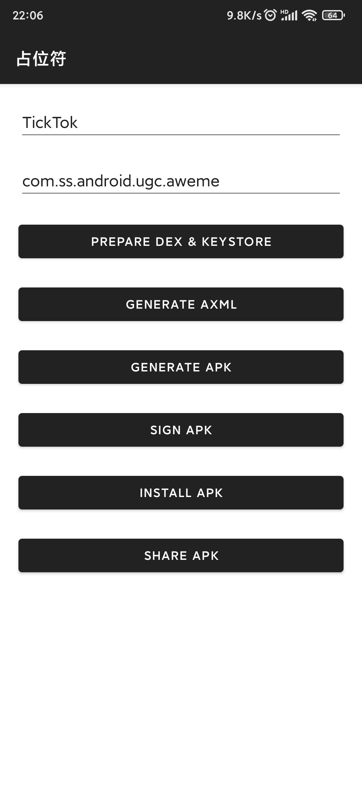

# Place Holder

可以生成具有指定包名的一个空的 APK 文件，由于签名不同，可以起到一定的防安装作用。

## How

从上到下依次点击，最后一个是分享。

## Why

我姥姥的手机经常受垃圾 APP 骚扰，广告很多。尽管关闭了“允许安装未知应用”，系统有时也会提供开启按钮，一不小心就又打开了。

我想，如果生成一个空的应用，提前占住包名，就可以防止应用安装了。

目前没有发现哪款系统会提供卸载按钮，更加放心。

一个空 APK 为 8.5 KB，安装后占用 55.81KB。

